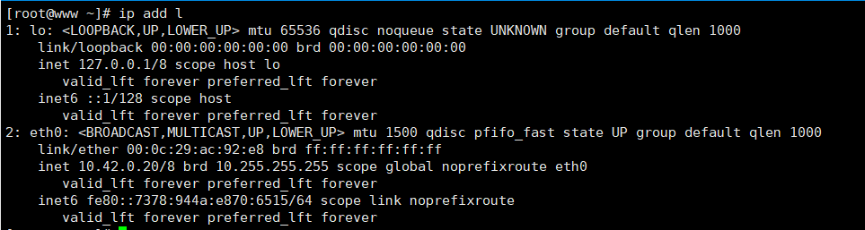

## 调整网卡名称

```
~]# cd /etc/sysconfig/network-scripts/
network-scripts]# mv ifcfg-ens33  ifcfg-eth0
```

## 调整网卡的配置信息

```
network-scripts]# vim ifcfg-eth0
TYPE=Ethernet
PROXY_METHOD=none
BROWSER_ONLY=no
BOOTPROTO=none
DEFROUTE=yes
IPV4_FAILURE_FATAL=no
IPV6INIT=yes
IPV6_AUTOCONF=yes
IPV6_DEFROUTE=yes
IPV6_FAILURE_FATAL=no
IPV6_ADDR_GEN_MODE=stable-privacy
NAME=eth0
UUID=7a776585-98d4-4816-8db1-017eccb65349
DEVICE=eth0
ONBOOT=yes
PREFIX=8
IPADDR=10.42.0.20
GATEWAY=10.42.0.1
DNS1=114.114.114.114

```

## 修改并生成grub配置

修改后的结果如下，也可以在安装系统或开机启动时进行调整。`net.ifnames=0 biosdevname=0`

```
network-scripts]# vim /etc/sysconfig/grub
GRUB_TIMEOUT=5
GRUB_DISTRIBUTOR="$(sed 's, release .*$,,g' /etc/system-release)"
GRUB_DEFAULT=saved
GRUB_DISABLE_SUBMENU=true
GRUB_TERMINAL_OUTPUT="console"
GRUB_CMDLINE_LINUX="crashkernel=auto rd.lvm.lv=centos/root rd.lvm.lv=centos/swap rhgb  net.ifnames=0 biosdevname=0 quiet"
GRUB_DISABLE_RECOVERY="true"

```
```
network-scripts]# grub2-mkconfig -o /boot/grub2/grub.cfg
```

## 重启系统

```
# reboot
```

