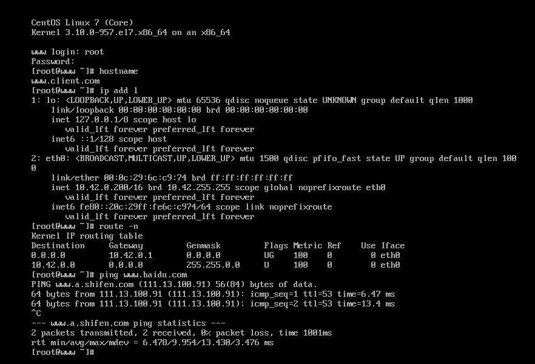
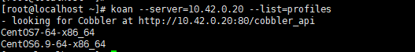
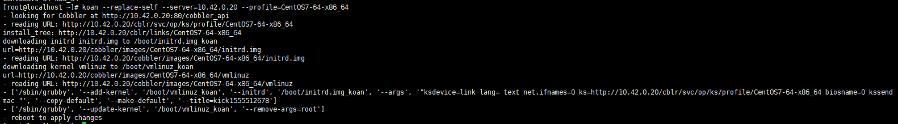

# 定制安装

获取帮助：` cobbler system add --help`
> 定制安装的意思是，我可以通过`MAC`地址给指定的机器安装系统，而且在安装完成后还可以对服务器做一些相应的修改，，上一篇我们1.初识Cobbler自动安装linux.md，我们已经安装好一台`CentOS7`的系统，那么现在我们就把那台机器重新安装。。并且我们给那台机器配置好`主机名`、`IP地址`。
## 1.获取机器的`MAC地址`
**00:0c:29:6c:c9:74**

## 2.在cobbler服务器上进行操作
```
~]# hostname
www.dengyou.com
~]# cobbler system add --name=www.client.com --mac-address=00:0c:29:6c:c9:74 --profile=CentOS7-64-x86_64 --ip-address=10.42.0.200 --subnet=255.255.0.0 --gateway=10.42.0.1 --interface=eth0 --static=1 --hostname=www.client.com --name-servers=10.42.0.1 --kickstart=/var/lib/cobbler/kickstarts/CentOS-7-x86_64.cfg
```
- `--name`：主机名
- `--ip-address=10.42.0.200`：客户机ip

列出我们要添加的机器：
```
~]# cobbler system list
  www.client.com
```

## 3.重新启动客户机，并让其重网卡启动

**vmware虚拟机**直接按`[F12]`**即可

## 4.验证



#自动化重装Koan

>我们的客户机已经安装了`CentOS6`,但是我现在想把它重装为`CentOS7`，这就需要如果需要我们手动调整到网卡启动，这是比较麻烦的。这里我们使用koan来重新安装。

## 1.安装koan

```
[root@localhost ~]# cat /etc/redhat-release
CentOS release 6.9 (Final)
[root@localhost ~]# yum install -y epel-release
```

## 2.获取cobbler服务端`10.42.0.20`可以选择重装的`profile(ks)`

- `~]# koan --server=10.42.0.20 --list=profiles`



## 3.重新安装`CentOS7-64-x86_64`

```
~]# koan --replace-self --server=10.42.0.20 --profile=CentOS7-64-x86_64
```



**重启生效**： `reboot`

注意：使用koan无需交互，就可以安装了
