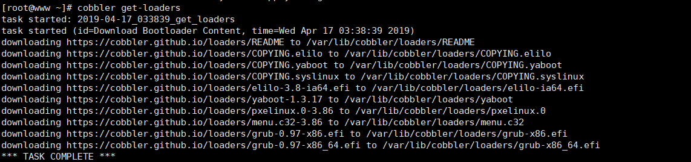

# cobbler简介

> Cobbler是一个免费开源系统安装部署软件，用于自动化网络安装操作系统。 Cobbler 集成了 DNS,DHCP,软件包更新,带外管理以及配置管理,方便操作系统安装自动化。Cobbler 可以支持PXE启动, 操作系统重新安装, 以及虚拟化客户机创建，包括Xen, KVM or VMware。 Cobbler透过koan程序以支持虚拟化客户机安装。Cobbler。可以支持管理复杂网路环境，如创建在链路聚合以太网的桥接环境。

[Cobbler官网](http://cobbler.github.io/)


# 基础环境查看及初始化
## 基础环境
### 1.查看主机名
```
~]# hostname
www.dengyou.com
```
### 2.操作系统（OS）
```
~]# cat /etc/redhat-release
CentOS Linux release 7.6.1810 (Core)
```
### 3.内核版本
```
~]# uname  -r
3.10.0-957.el7.x86_64
```
### 4.用户信息
```
~]# whoami
root
```
### 5.网卡信息
```
~]# ip  add list
1: lo: <LOOPBACK,UP,LOWER_UP> mtu 65536 qdisc noqueue state UNKNOWN group default qlen 1000
    link/loopback 00:00:00:00:00:00 brd 00:00:00:00:00:00
    inet 127.0.0.1/8 scope host lo
       valid_lft forever preferred_lft forever
    inet6 ::1/128 scope host
       valid_lft forever preferred_lft forever
2: eth0: <BROADCAST,MULTICAST,UP,LOWER_UP> mtu 1500 qdisc pfifo_fast state UP group default qlen 1000
    link/ether 00:0c:29:ac:92:e8 brd ff:ff:ff:ff:ff:ff
    inet 10.42.0.20/8 brd 10.255.255.255 scope global noprefixroute eth0
       valid_lft forever preferred_lft forever
    inet6 fe80::7378:944a:e870:6515/64 scope link noprefixroute
       valid_lft forever preferred_lft forever

```
### 6.网卡配置文件`/etc/sysconfig/network-scripts/ifcfg-eth0 `
```
~]# cat /etc/sysconfig/network-scripts/ifcfg-eth0
TYPE=Ethernet
PROXY_METHOD=none
BROWSER_ONLY=no
BOOTPROTO=none
DEFROUTE=yes
IPV4_FAILURE_FATAL=no
IPV6INIT=yes
IPV6_AUTOCONF=yes
IPV6_DEFROUTE=yes
IPV6_FAILURE_FATAL=no
IPV6_ADDR_GEN_MODE=stable-privacy
NAME=eth0
UUID=7a776585-98d4-4816-8db1-017eccb65349
DEVICE=eth0
ONBOOT=yes
PREFIX=8
IPADDR=10.42.0.20
GATEWAY=10.42.0.1
DNS1=114.114.114.114
```
## 初始化配置
### 1.关闭`Selinux`
### 2.关闭防火墙
### 3.关闭`postfix`

### 4.配置yum仓库
```
[root@www ~]# mv /etc/yum.repos.d/CentOS-Base.repo /etc/yum.repos.d/CentOS-Base.repo.backup                    
[root@www ~]# wget -O /etc/yum.repos.d/CentOS-Base.repo http://mirrors.aliyun.com/repo/Centos-7.repo        
[root@www ~]# wget -O /etc/yum.repos.d/epel.repo http://mirrors.aliyun.com/repo/epel-7.repo  
```
# 正式安装Cobbler
## 1.安装`cobbler`所需要的软件包
```
[root@www ~]# yum install -y httpd dhcp tftp cobbler cobbler-web pykickstart  xinetd
```
## 2.启动`httpd`和`cobbler服务`,并设置其能开机自启
```
[root@www ~]# systemctl  start httpd
[root@www ~]# systemctl  start cobblerd
[root@www ~]# systemctl enable httpd
[root@www ~]# systemctl  enable cobbler
```
## 3.配置cobbler
### a.执行`cobbler check`,查看cobbler所需要的配置

我们需要解决上面的问题才可以继续使用`cobbler`,解决完之后，我们需要使用`cobbler sync`应用更改，上面的问题分别是：

- 编辑`/etc/cobbler/settings`文件，找到`server`选项，修改为Cobbler服务器ip地址
- 编辑`/etc/cobbler/settings`文件，找到`next_server`选项，修改为PXE服务器的IP地址
- 编辑`/etc/xinetd.d/tftp`文件，将文件中的disable字段的配置由yes改为no
- 执行`cobbler get-loaders`，系统将自动下载loader程序
通过systemctl启动rsyncd.service服务
提示说debian的镜像包没有安装，如果你需要安装ubuntu的系统安装，否则就忽略
修改cobbler用户的默认密码，可以使用如下命令生成密码，并使用生成后的密码替换/etc/cobbler/settings中的密码。生成密码命令：openssl passwd -1 -salt 'random-phrase-here' 'your-password-here'
没有找到电源管理工具，你可以安装cman or fence-agents to use them

### c.修改`next_server`与`server`的地址:
```
[root@www ~]# vim /etc/cobbler/settings
next_server: 10.42.0.20
server: 10.42.0.20
manage_dhcp: 1    #让cobbler管理dhcp
```
### d.将tftp服务托管给xinetd服务,并运行tftp服务
```
[root@www ~]# vim /etc/xinetd.d/tftp
      disable                = no

[root@www ~]# systemctl  start xinetd
[root@www ~]# systemctl  enable  xinetd
```
### e.下载loader程序`~]# cobbler get-loaders`


### f.设置`root`密码
```
[root@www ~]# openssl  passwd -1 -salt "salt"  'dengyou'  #其中【dengyou】为密码
$1$salt$jO9Of6aCx62fWYAJ9QNnH0
[root@www ~]# vim /etc/cobbler/settings
default_password_crypted: "$1$salt$IbRkpBgAWG4UIV3zweVwG/"
```
### g.重启cobbler服务
```
root@www ~]# systemctl  restart cobblerd.service
```
### h.再次执行`cobbler check`

上面的报错可以忽略，注意：一定要确保所有的问题解决了
## 4.配置`~]# vim /etc/cobbler/dhcp.template`


## 5.同步cobbler配置文件`~]# cobbler sync`


## 6.挂载镜像
```
~]# mkdir /mnt/centos7
~]# mount /dev/cdrom  /mnt/CentOS7  #挂在光盘
~]# mkdir /mnt/centos6
~]# mount -t iso9660 -o loop CentOS-6.9-x86_64-bin-DVD1.iso /mnt/centos6 # 上传镜像上去挂载
```
## 7.导入镜像，注意：下面的导入比较慢，请耐性等待
```
~]# cobbler import --path=/mnt/centos7 --name=CentOS7_x86-64  --arch=x86_64
~]# cobbler import --path=/mnt/centos6 --name=CentOS6_x86-64 --arch=x86_64
```
- `--path=`:镜像路径
- `--name=`: 安装操作系统时显示的名称
-  `--arch=`:系统架构

** 验证是否导入成功**
- 查看导入镜像文件的存放目录：`~]# ls /var/www/cobbler/ks_mirror/`
- 查看导入的镜像`cobbler list `或`cobbler profile report`
- 查看某个镜像的信息：`# cobbler profile report --name=CentOS6-64-x86_64`


## 8.提供`kickstart`文件,并复制到`/var/lib/cobbler/kickstarts`目录下
```
~]# vim CentOS-7-x86_64.cfg
#Kickstart Configurator for cobbler by Jason Zhao
#platform=x86, AMD64, or Intel EM64T
#System  language
lang en_US
#System keyboard
keyboard us
#Sytem timezone
timezone Asia/Shanghai
#Root password
rootpw --iscrypted $default_password_crypted
#Use text mode install
text
#Install OS instead of upgrade
install
#Use NFS installation Media
url --url=$tree
#System bootloader configuration
bootloader --location=mbr
#Clear the Master Boot Record
zerombr
#Partition clearing information
clearpart --all --initlabel
#Disk partitioning information
part /boot --fstype xfs --size 1024 --ondisk sda
part swap --size 16384 --ondisk sda
part / --fstype xfs --size 1 --grow --ondisk sda
#System authorization infomation
auth  --useshadow  --enablemd5
#Network information
$SNIPPET('network_config')
#network --bootproto=dhcp --device=em1 --onboot=on
# Reboot after installation
reboot
#Firewall configuration
firewall --disabled
#SELinux configuration
selinux --disabled
#Do not configure XWindows
skipx
#Package install information
%pre
$SNIPPET('log_ks_pre')
$SNIPPET('kickstart_start')
$SNIPPET('pre_install_network_config')
# Enable installation monitoring
$SNIPPET('pre_anamon')
%end

%packages
@ base
@ core
sysstat
iptraf
ntp
lrzsz
ncurses-devel
openssl-devel
zlib-devel
OpenIPMI-tools
mysql
nmap
screen
%end

%post
systemctl disable postfix.service
%end
```
```
[root@www ~]# cat CentOS-6-x86_64.cfg
#Kickstart Configurator for cobbler by Jason Zhao
#platform=x86, AMD64, or Intel EM64T
key --skip
#System  language
lang en_US
#System keyboard
keyboard us
#Sytem timezone
timezone Asia/Shanghai
#Root password
rootpw --iscrypted $default_password_crypted
#Use text mode install
text
#Install OS instead of upgrade
install
#Use NFS installation Media
url --url=$tree
#System bootloader configuration
bootloader --location=mbr
#Clear the Master Boot Record
zerombr yes
#Partition clearing information
clearpart --all --initlabel
#Disk partitioning information
part /boot --fstype ext4 --size 1024 --ondisk sda
part swap --size 16384 --ondisk sda
part / --fstype ext4 --size 1 --grow --ondisk sda
#System authorization infomation
auth  --useshadow  --enablemd5
#Network information
$SNIPPET('network_config')
#network --bootproto=dhcp --device=em1 --onboot=on
#Reboot after installation
reboot
#Firewall configuration
firewall --disabled
#SELinux configuration
selinux --disabled
#Do not configure XWindows
skipx
#Package install information
%packages
@ base
@ chinese-support
@ core
sysstat
iptraf
ntp
e2fsprogs-devel
keyutils-libs-devel
krb5-devel
libselinux-devel
libsepol-devel
lrzsz
ncurses-devel
openssl-devel
zlib-devel
OpenIPMI-tools
mysql
lockdev
minicom
nmap

%post
#/bin/sed -i 's/#Protocol 2,1/Protocol 2/' /etc/ssh/sshd_config
/bin/sed  -i 's/^ca::ctrlaltdel:/#ca::ctrlaltdel:/' /etc/inittab
/sbin/chkconfig --level 3 diskdump off
/sbin/chkconfig --level 3 dc_server off
/sbin/chkconfig --level 3 nscd off
/sbin/chkconfig --level 3 netfs off
/sbin/chkconfig --level 3 psacct off
/sbin/chkconfig --level 3 mdmpd off
/sbin/chkconfig --level 3 netdump off
/sbin/chkconfig --level 3 readahead off
/sbin/chkconfig --level 3 wpa_supplicant off
/sbin/chkconfig --level 3 mdmonitor off
/sbin/chkconfig --level 3 microcode_ctl off
/sbin/chkconfig --level 3 xfs off
/sbin/chkconfig --level 3 lvm2-monitor off
/sbin/chkconfig --level 3 iptables off
/sbin/chkconfig --level 3 nfs off
/sbin/chkconfig --level 3 ipmi off
/sbin/chkconfig --level 3 autofs off
/sbin/chkconfig --level 3 iiim off
/sbin/chkconfig --level 3 cups off
/sbin/chkconfig --level 3 openibd off
/sbin/chkconfig --level 3 saslauthd off
/sbin/chkconfig --level 3 ypbind off
/sbin/chkconfig --level 3 auditd off
/sbin/chkconfig --level 3 rdisc off
/sbin/chkconfig --level 3 tog-pegasus off
/sbin/chkconfig --level 3 rpcgssd off
/sbin/chkconfig --level 3 kudzu off
/sbin/chkconfig --level 3 gpm off
/sbin/chkconfig --level 3 arptables_jf off
/sbin/chkconfig --level 3 dc_client off
/sbin/chkconfig --level 3 lm_sensors off
/sbin/chkconfig --level 3 apmd off
/sbin/chkconfig --level 3 sysstat off
/sbin/chkconfig --level 3 cpuspeed off
/sbin/chkconfig --level 3 rpcidmapd off
/sbin/chkconfig --level 3 rawdevices off
/sbin/chkconfig --level 3 rhnsd off
/sbin/chkconfig --level 3 nfslock off
/sbin/chkconfig --level 3 winbind off
/sbin/chkconfig --level 3 bluetooth off
/sbin/chkconfig --level 3 isdn off
/sbin/chkconfig --level 3 portmap off
/sbin/chkconfig --level 3 anacron off
/sbin/chkconfig --level 3 irda off
/sbin/chkconfig --level 3 NetworkManager off
/sbin/chkconfig --level 3 acpid off
/sbin/chkconfig --level 3 pcmcia off
/sbin/chkconfig --level 3 atd off
/sbin/chkconfig --level 3 sendmail off
/sbin/chkconfig --level 3 haldaemon off
/sbin/chkconfig --level 3 smartd off
/sbin/chkconfig --level 3 xinetd off
/sbin/chkconfig --level 3 netplugd off
/sbin/chkconfig --level 3 readahead_early off
/sbin/chkconfig --level 3 xinetd off
/sbin/chkconfig --level 3 ntpd on
/sbin/chkconfig --level 3 avahi-daemon off
/sbin/chkconfig --level 3 ip6tables off
/sbin/chkconfig --level 3 restorecond off
/sbin/chkconfig --level 3 postfix off
```
```
~]# cp CentOS-6-x86_64.cfg  CentOS-7-x86_64.cfg  /var/lib/cobbler/kickstarts/
```
## 8.修改默认的默认的ks文件
```
~]# cobbler profile edit --name=CentOS6.9-64-x86_64 --kickstart=/var/lib/cobbler/kickstarts/CentOS-6-x86_64.cfg
~]# cobbler profile edit --name=CentOS7-64-x86_64 --kickstart=/var/lib/cobbler/kickstarts/CentOS-7-x86_64.cfg
```
查看修改后的`ks`文件路径

## 9.修改CentOS7镜像的内核参数，让系统安装完成之后，网卡名默认为`eth0`
```
[root@www ~]# cobbler profile edit --name=CentOS7-64-x86_64 --kopts='net.ifnames=0 biosname=0'
```
我们可以这样查看添加的内核参数`cobbler profile report --name=CentOS7-64-x86_64|grep "Kernel Options"`

## 10.定制`cobbler`系统安装界面
```
~]# cd /etc/cobbler/pxe/
[root@www pxe]# vim pxedefault.template

DEFAULT menu
PROMPT 0
MENU TITLE Cobbler | http://cobbler.dengyou.com  #
TIMEOUT 200
TOTALTIMEOUT 6000
ONTIMEOUT $pxe_timeout_profile

LABEL local
        MENU LABEL (local)
        MENU DEFAULT
        LOCALBOOT -1

$pxe_menu_items

MENU end
```
## 11.应用配置-`~]# cobbler sync`

## 12.新建虚拟机并安装
### 测试CentOS7


启动系统进入安装界面，选择安装的操作系统，这里我们选择CentOS-7，然后回车


### 报错解决：


这里总是报一下错误，我们把客户机的内存调到`>1G`问题就解决了。

###  测试CentOS6
  CentOS6 测试没问题
